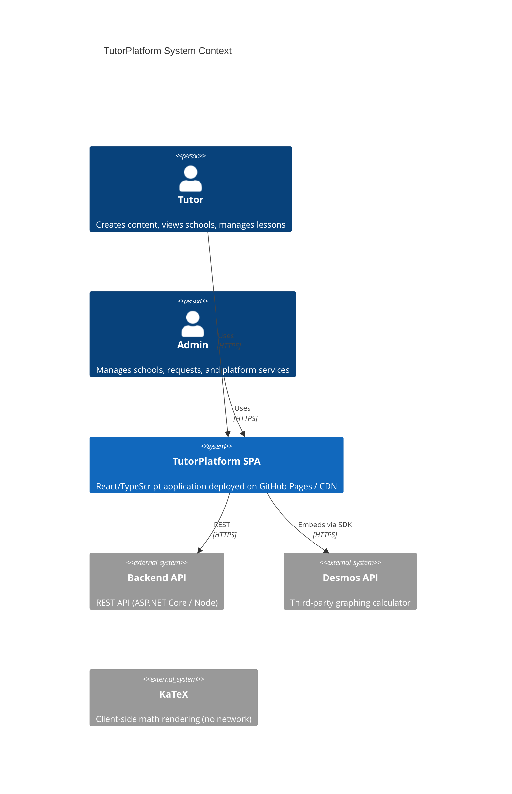
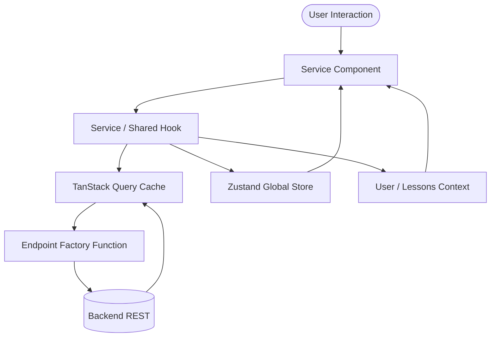
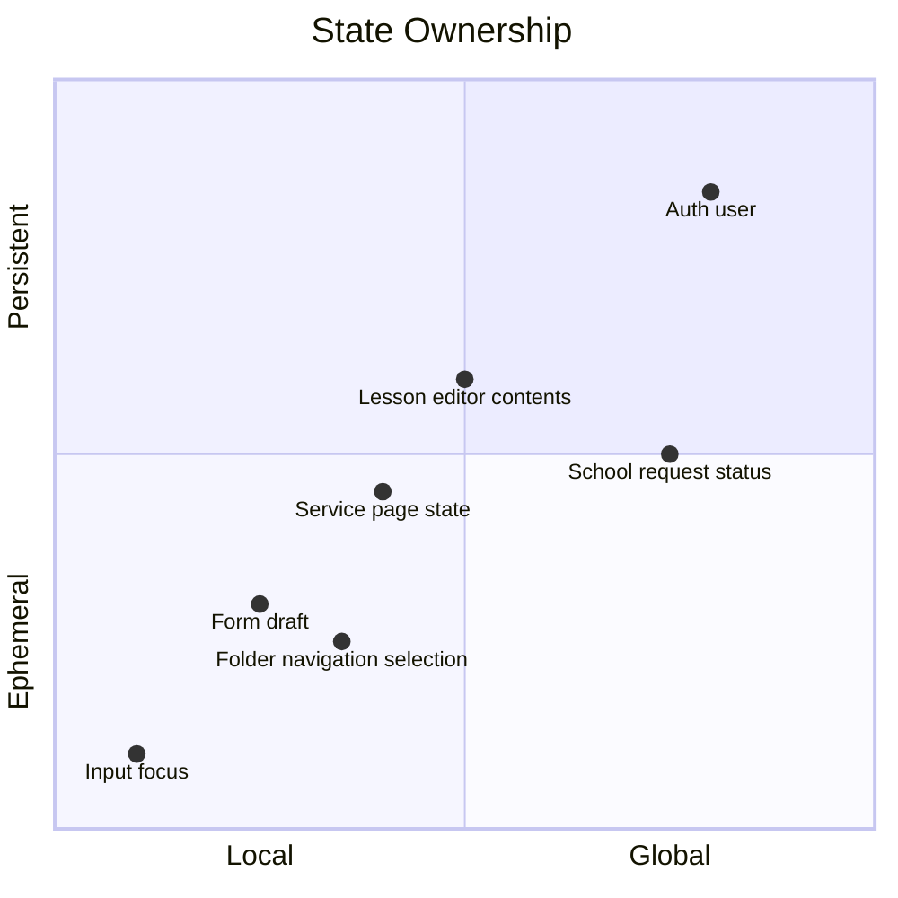
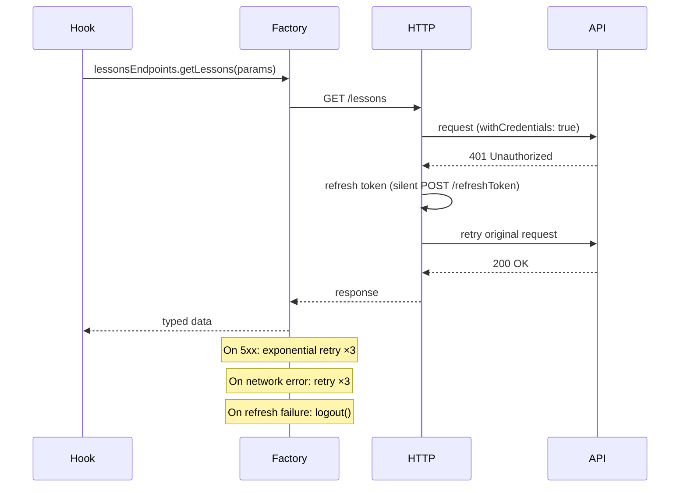
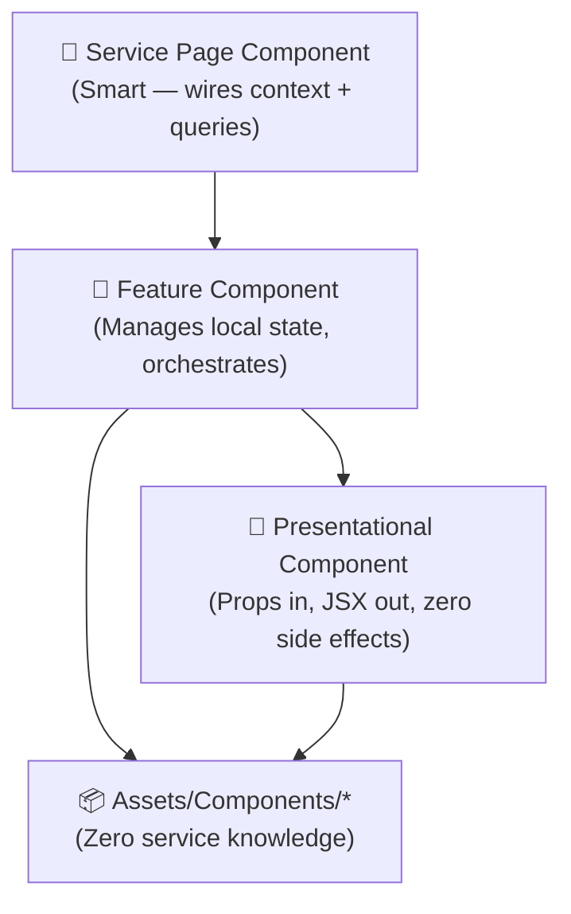
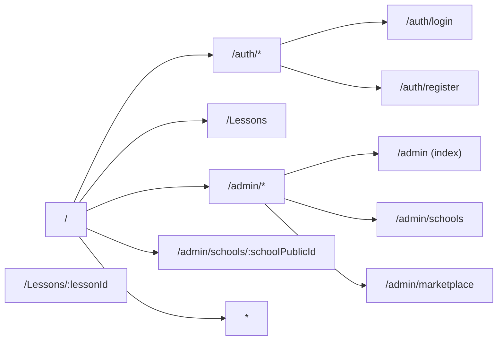

# TutorPlatform — Frontend Architecture
 
> **Stack at a Glance:** React 19 · TypeScript 5.9 · Vite 7 · MUI v9 · Zustand · TanStack Query · Zod · Lexical · KaTeX · Desmos · Vitest
 
---
 
## Table of Contents
 
1. [High-Level Architecture](#1-high-level-architecture)
2. [Project Folder Structure](#2-project-folder-structure)
3. [State Management Strategy](#3-state-management-strategy)
4. [API Layer Design](#4-api-layer-design)
5. [Component Architecture](#5-component-architecture)
6. [Routing Architecture](#6-routing-architecture)
7. [Performance Considerations](#7-performance-considerations)
8. [Testing Strategy](#8-testing-strategy)
9. [Security Considerations](#9-security-considerations)
10. [Scalability Plan](#10-scalability-plan)
11. [Recommended Tech Stack](#11-recommended-tech-stack)
12. [Example Implementations](#12-example-implementations)
 
---
 
## 1. High-Level Architecture
 
### Architectural Style
 
The application follows a **Modular Monolith** on the frontend — one deployable unit (Vite SPA) internally divided into self-contained service slices. Each service slice owns its page, local state, components, hooks, and types. Cross-cutting concerns (auth, theme) live in dedicated layers shared by all slices.
 
This is intentionally **not** micro-frontend architecture. The project is a single tutor SaaS; micro-frontends would add deployment complexity without benefit at this scale. The architecture is designed so it *could* be split later without structural rewrites.
 
### System Context Diagram
 

 
### Core Modules and Responsibilities
 
| Module | Responsibility |
|--------|---------------|
| **Assets** | Global icons, art, shared components, hooks, and themes |
| **Endpoints** | All API communication — every function exported through a resilience factory (retry, token refresh) |
| **Storage / Context** | Zustand global store (`useGlobalContext` for auth) + React context (`UserContext` for storage persistence, `LessonsContext` for file management) |
| **Services** | Feature slices — one folder per product surface (Lessons, AdminPanel, Auth, Schools) |
| **Router** | React Router v7 with route layout definitions (`AppRoutes.tsx`) and ProtectedRoute wrapper |
 
### Data Flow Overview
 

 
**Rules:**
 - Components never call `fetch` directly — all network traffic goes through the Endpoint layer.
 - TanStack Query owns server-state lifecycle (loading, error, cache, refetch).
 - Zustand and UserContext own cross-service global state (authenticated user identity, session, token refresh actions).
 - LessonsContext owns page-scoped ephemeral state for lessons filesystem management.
 
---

## 2. Project Folder Structure

All files must be organized like this
- Assets
  - Art (icons and illustrations)
  - Components (reusable components, e.g. Modal, Notification)
  - Hooks (shared hooks, e.g. useModal, useNotification)
  - Types (common TypeScript types)
  - globalStyles.tsx (CSS Baseline overrides)
  - theme.ts (MUI theme definition)
- Endpoints (axios factory client, auth and business endpoints)
- Storage
  - Context
    - UserContext.tsx (local storage session state)
    - LessonsContext.tsx (lessons filer state)
    - useGlobalContext.ts (Zustand auth store)
- Services
  - /AdminPanel
  - /Auth
  - /Lessons
  - /Schools
  - /NotFound
- Router
  - ProtectedRoute.tsx (access validation)
- AppRoutes.tsx (main routing layout)
- main.tsx (entry point)

### Organisation Rationale

The structure is **feature-first at the top level, layer-first inside each feature**.

Pure layer-first (`/components`, `/hooks`, `/api` at root) collapses under scale — a developer editing the Scheduling feature has to navigate three separate top-level directories. Pure feature-first without shared layers leads to duplicated `Button` implementations across services.

The hybrid solves both: shared infrastructure lives in `Assets/`, `Endpoints/`, and `Storage/`; feature code is fully co-located inside `Services/ServiceName/`. This mirrors the Screaming Architecture principle — opening `src/Services/` immediately communicates what the product *does*.

---

## 3. State Management Strategy
 

 
### Local State (`useState` / `useReducer`)
 
Use for UI-only state that doesn't need to outlive the component:
 - Modal open/close
 - Form field focus
 - Accordion expanded state
 - Tooltip visibility
 
**Rule:** If two sibling components need it → lift to service context or layout provider. If two *services* need it → Zustand or shared context.
 
### Server State (TanStack Query)
 
All data that originates from the backend is owned by TanStack Query. Never copy server responses into Zustand — that creates a synchronisation problem.
 
```ts
// useLessons.ts — server state example
export function useLessons(): UseLessonsReturn {
  const schoolId = useSchoolId();
  const { folderId: currentFolderId, search: searchQuery, sort, order: sortOrder } = useLessonsContext();
 
  return useQuery<Lesson[], AppError>({
    queryKey: ['lessons', schoolId],
    queryFn: () => filesEndpoints.listFiles(schoolId).then((files) => files.filter(isLessonFile).map(apiFileToLesson)),
    staleTime: 2 * 60 * 1000,
    select: (data) => {
      // filtering and sorting logic...
    }
  });
}
```
 
### Service-Scoped Context
 
Per-service React context holds ephemeral page state that multiple components on the same page share but that doesn't need to survive navigation. Prefer this over prop drilling and over Zustand for service-local concerns.
 
```ts
// Storage/Context/LessonsContext.tsx
export interface LessonsContextValue {
  folderId: string | null;
  setFolderId: (id: string | null) => void;
  search: string;
  setSearch: (search: string) => void;
  sort: string;
  setSort: (sort: string) => void;
  order: 'asc' | 'desc';
  setOrder: (order: 'asc' | 'desc') => void;
  view: 'grid' | 'list';
  setView: (view: 'grid' | 'list') => void;
}
```
 
### Global State (Zustand — `useGlobalContext` & React `UserContext`)
 
Only the auth slice lives here to keep state light and maintainable:
 
| Slice / Context | Contents |
|-------|----------|
| `auth` (Zustand) | Current user, user identity mapping, roles, and login/logout methods |
| `UserContext` | UserIdentity (JWT token, refresh token) persisted to `localStorage` |
 
**Why Zustand?** Zustand is used for clean, minimal boilerplate global state. It avoids the React Context re-render issues and is easily accessible outside React (e.g. inside Axios request/response interceptors if needed).
 
---

## 4. API Layer Design
 
### Resilience Factory
 
Every endpoint function is wrapped by the factory before export. No consumer ever calls raw fetch/axios.
 

 
### `Endpoints/factory.ts`
 
```ts
import axios, { type AxiosInstance } from 'axios';
import axiosRetry from 'axios-retry';
import { useGlobalContext } from '@/Storage/Context/useGlobalContext';
 
let isRefreshing = false;
let refreshSubscribers: Array<() => void> = [];
 
function subscribeToRefresh(cb: () => void) {
  refreshSubscribers.push(cb);
}
 
function onRefreshed() {
  refreshSubscribers.forEach((cb) => cb());
  refreshSubscribers = [];
}
 
export interface AppError {
  message: string;
  code: string;
  status?: number;
}
 
function normaliseError(error: unknown): AppError {
  if (axios.isAxiosError(error)) {
    return {
      message: error.response?.data?.message ?? error.message,
      code: error.response?.data?.code ?? 'UNKNOWN',
      status: error.response?.status,
    };
  }
  return {
    message: error instanceof Error ? error.message : 'Unexpected error',
    code: 'UNKNOWN',
  };
}
 
export function createApiClient(baseURL: string): AxiosInstance {
  const instance = axios.create({
    baseURL,
    timeout: 15_000,
    withCredentials: true
  });
 
  instance.interceptors.response.use(
    (res) => res,
    async (error) => {
      const originalRequest = error.config;
      if (error.response?.status !== 401 || originalRequest._retry) {
        return Promise.reject(normaliseError(error));
      }
 
      if (isRefreshing) {
        return new Promise((resolve) => {
          subscribeToRefresh(() => {
            resolve(instance(originalRequest));
          });
        });
      }
 
      originalRequest._retry = true;
      isRefreshing = true;
 
      try {
        await axios.post(`${baseURL}/api/ApiAuth/refreshToken`, undefined, {
          withCredentials: true,
        });
 
        onRefreshed();
        return instance(originalRequest);
      } catch (refreshErr) {
        useGlobalContext.getState().auth.logout();
        return Promise.reject(normaliseError(refreshErr));
      } finally {
        isRefreshing = false;
      }
    }
  );
 
  axiosRetry(instance, {
    retries: 3,
    retryDelay: axiosRetry.exponentialDelay,
    retryCondition: (err) =>
      axiosRetry.isNetworkOrIdempotentRequestError(err) ||
      (err.response?.status ?? 0) >= 500,
  });
 
  return instance;
}
```
 
### Endpoint Module Pattern
 
```ts
// Endpoints/lessons.endpoints.ts
import { createApiClient } from '@/Endpoints/factory';
import type { Lesson, LessonFolder } from '@/Services/Lessons/components/FileManager/FileManager.types';
 
const client = createApiClient(import.meta.env.VITE_API_BASE_URL || '');
 
export const lessonsEndpoints = {
  getLessons: (params?: {
    folderId?: string | null;
    search?: string;
    sort?: string;
    order?: 'asc' | 'desc';
  }): Promise<Lesson[]> =>
    client.get<Lesson[]>('/lessons', { params }).then((res) => res.data),
 
  getLessonById: (id: string): Promise<Lesson> =>
    client.get<Lesson>(`/lessons/${id}`).then((res) => res.data),
 
  createLesson: (body: {
    title: string;
    folderId: string | null;
  }): Promise<Lesson> =>
    client.post<Lesson>('/lessons', body).then((res) => res.data),
 
  updateLesson: (
    id: string,
    body: Partial<{ title: string; folderId: string | null; status: string }>
  ): Promise<Lesson> =>
    client.patch<Lesson>(`/lessons/${id}`, body).then((res) => res.data),
 
  deleteLesson: (id: string): Promise<void> =>
    client.delete<void>(`/lessons/${id}`).then((res) => res.data),
};
```

### Caching Strategy
 
| Data type | `staleTime` | `gcTime` | Strategy |
|---|---|---|---|
| Auth user | `Infinity` | `Infinity` | React UserContext / Zustand, not TQ |
| Lessons files | 2 min | 5 min | Background refetch on changes |
| School requests | 1 min | 5 min | Regular refetching |
 
---
 
## 5. Component Architecture
 

 
### Smart Components (Page-level)
 
- Live in `Services/ServiceName/ComponentNamePage.tsx` (e.g. `LessonsMainPage.tsx`)
- Subscribe to TanStack Query hooks, `LessonsContext`, and `UserContext`
- Handle loading/error states via MUI Skeleton, Progress, and ErrorBoundary
- Route entry points defined in the router
 
### Feature Components
 
- Live in `Services/ServiceName/components/ComponentName/`
- Own local UI state (`useState`)
- May call service-specific hooks
- Receive data via props from the page or service context
 
### Shared / Presentational (`Assets/Components`)
 
- Zero imports from `Services/` or `Endpoints/` — strictly isolated
- Accept all data and callbacks via typed props
- Cover: `Modal`, `Notification`, `PillButtonGroup`, `StatusIcon`, `ErrorBoundary`
 
### File Co-location Rules
 
Every component folder is a mini-package:
 
```
ComponentName/
  component.tsx           ← JSX, event handlers, renders sub-components
  component.styles.ts     ← sx prop objects or styled() — NO inline sx in tsx
  component.types.ts      ← Props interface, local enums, API shape types
  component.const.ts      ← Magic strings, CSS class names, default values
  component.test.tsx      ← Vitest + Testing Library tests
  utils.ts                ← Pure functions used only by this component
  hooks/                  ← Hooks used only by this component or its children
    hookName/
      hook.ts
      hook.types.ts
      tests/
```
 
**Why `component.styles.ts`?** Keeping MUI `sx` objects in a separate file prevents the JSX from becoming unreadable at scale. The styles file exports plain objects consumed via the `sx` prop — this approach beats `styled-components` for MUI because it participates natively in the MUI theme system.
 
**Why `component.const.ts`?** CSS class names and string literals scattered across components are a maintenance hazard. A dedicated constants file is the single source of truth and makes rename refactors trivial.
 
---
 
## 6. Routing Architecture
 

 
### Route Definitions
 
Routes are configured in a single nested layout array inside [AppRoutes.tsx](file:///Users/zhoyd/WebstormProjects/Frontend/src/AppRoutes.tsx):
 
```tsx
const routes: RouteObject[] = [
  {
    element: <PublicLayout />,
    children: [
      { path: "/", element: <Navigate to="/auth/login"/> },
      { path: "/Lessons", element: <LessonsMainPage /> },
      { path: "/Lessons/:lessonId", element: <LessonIdPage /> },
    ],
  },
  {
    path: "/admin",
    element: <AdminPanelLayout />,
    children: [
      { index: true, element: <DashboardHome /> },
      { path: "schools", element: <SchoolsPage /> },
      { path: "marketplace", element: <MarketplacePage /> },
      { path: "services/*", element: <AdminPlaceholder /> },
    ],
  },
  {
    path: "/admin/schools/:schoolPublicId",
    element: <SchoolLayout />,
    children: [
      { index: true, element: <SchoolOverviewPage /> },
    ],
  },
  {
    path: "/auth",
    element: <AuthLayout />,
    children: [
      { path: "login", element: <LoginPage /> },
      { path: "register", element: <RegisterPage /> },
    ],
  },
  { path: "*", element: <NotFoundPage /> },
];
```
 
### Protected Route
 
ProtectedRoute is defined in [ProtectedRoute.tsx](file:///Users/zhoyd/WebstormProjects/Frontend/src/Router/ProtectedRoute.tsx) and uses Zustand's `auth.isAuthenticated` state:
 
```tsx
import { Navigate, Outlet } from 'react-router-dom';
import { useGlobalContext } from '@/Storage/Context/useGlobalContext';
 
export default function ProtectedRoute() {
  const isAuthenticated = useGlobalContext((s) => s.auth.isAuthenticated);
 
  if (!isAuthenticated) {
    return <Navigate to="/auth/login" replace />;
  }
 
  return <Outlet />;
}
```
 
Routes can be wrapped in `<ProtectedRoute>` to prevent unauthorized access. Lazy loading can be applied for heavy editor or graphing chunks if bundle size optimization is needed.
 
---

## 7. Performance Considerations

### Code Splitting

```
Initial bundle (critical path only)
├── React runtime            ~45 KB
├── React Router             ~25 KB
├── MUI core tokens          ~30 KB
└── App shell + auth         ~20 KB
                            ────────
                            ~120 KB gz

Lazy chunks (loaded on demand)
├── Editor chunk             Lexical + plugins + KaTeX
└── Desmos chunk             Desmos embed wrapper
```
 
Vite's `build.rollupOptions.manualChunks` configuration (when manual chunks are configured):
 
```ts
// vite.config.ts
manualChunks: {
  'vendor-react':    ['react', 'react-dom', 'react-router-dom'],
  'vendor-mui':      ['@mui/material', '@mui/icons-material'],
  'vendor-lexical':  ['lexical', '@lexical/react'],
  'vendor-query':    ['@tanstack/react-query'],
}
```
 
### Memoisation Rules
 
Only apply when profiling identifies a performance bottleneck.
 
**Apply `useMemo`:**
- Expensive derived values (e.g. sorting and filtering lessons array in `useLessons`)
- Creating stable object references passed as context provider values
- KaTeX/Desmos configuration structures
 
**Apply `useCallback`:**
- Callback functions passed down to memoised child components
 
**Apply `React.memo`:**
- Large list rendering components (e.g., files and folders list in the FileManager)
 
### Rendering Optimisation
 
- **Image optimisation:** Serve visual assets with width/format parameters; use `` on heavy lists.
- **Lazy loading:** Dynamic importing of heavy editing nodes.
 
---
 
## 8. Testing Strategy
 
```mermaid
pyramid
    title Testing Pyramid
    "Integration (Vitest + MSW)" : 30
    "Unit (Vitest + Testing Library)" : 70
```
 
### Unit Tests (`*.test.tsx` / `*.test.ts` alongside code)
 
Scope: single utility or component in isolation. Mock all external query hooks and contexts.
 
```ts
// src/Services/Lessons/components/FileManager/tests/utils.test.ts
import { describe, it, expect } from 'vitest';
import { getBreadcrumbPath } from '../utils';
 
describe('FileManager getBreadcrumbPath utility', () => {
  it('returns correctly formatted breadcrumbs path', () => {
    const folders = [{ id: '2', name: 'Math', parentId: '1' }];
    expect(getBreadcrumbPath(folders, '2')).toEqual(['Math']);
  });
});
```
 
### Integration Tests (Vitest + MSW)
 
Scope: React hooks + API client operations + MSW server interception. Validates request-response flows in the hooks.
 
```ts
// src/Services/Lessons/hooks/useLessons/tests/useLessons.test.ts
import { renderHook, waitFor } from '@testing-library/react';
import { describe, it, expect } from 'vitest';
import { useLessons } from '../useLessons';
// MSW handler intercepts GET /lessons and returns mock array
```
 
### E2E Tests (Roadmap)
 
End-to-end testing (e.g. Playwright) is planned for critical user authentication and lesson editing flows, but is not currently configured in the workspace package dependencies.
 
### Tools Summary
 
| Need | Tool |
|------|------|
| Test runner | Vitest |
| Component testing | `@testing-library/react` |
| API mocking | MSW 2 |
| Linting | ESLint 9 |
 
---

## 9. Security Considerations

### Authentication

- Tokens stored in **memory only** (Zustand in-memory store). Never `localStorage`, never `sessionStorage`.
- Refresh token stored in an `HttpOnly`, `Secure`, `SameSite=Strict` cookie set by the backend — the SPA never reads it.
- Silent refresh performed by the Endpoint factory (Section 4) before expiry using a scheduled interval.
- On tab close and re-open: the SPA detects an expired in-memory access token, makes one silent refresh attempt via the HttpOnly cookie, then falls back to the login page.

### XSS Prevention

- **Never use `dangerouslySetInnerHTML`** — all HTML from the backend is rendered through the read-only Lexical `RichTextViewer` which sanitises the Lexical JSON format, not raw HTML.
- MUI components render via React's virtual DOM — no raw HTML injection surface.
- All user-generated formula content goes through KaTeX's own sanitiser before render.
- Content Security Policy (CSP) header set by the CDN/server:
  ```
  Content-Security-Policy:
    default-src 'self';
    script-src 'self' https://www.desmos.com;
    frame-src https://www.desmos.com;
    img-src 'self' data: https://<cdn-domain>;
    connect-src 'self' https://<api-domain> wss://<api-domain>;
  ```

### Authorization

- Role is stored in the JWT claim and validated on every API call by the backend.
- The `<RoleGuard>` component hides UI elements from unauthorised roles but **never relies on this as a security boundary** — the backend enforces all role checks.
- Module feature flags (enabled/disabled by tutor) are validated server-side; the frontend merely reflects the config.

### Secure Storage Practices

| Data | Storage | Reason |
|------|---------|--------|
| Access token | Zustand memory | XSS-resistant; lost on tab close (by design) |
| Refresh token | HttpOnly cookie | JS cannot read; safe from XSS |
| User preferences | `localStorage` (non-sensitive) | Survives reload; no PII |
| Draft editor content | `IndexedDB` via Lexical | Structured data; large size; no tokens |
| SignalR connection ID | Memory | Ephemeral per session |

---

## 10. Scalability Plan

### Small Project (1–3 developers, MVP)

- Use all layers described above even at small scale — the cost is low, the structural debt avoided is high.
- Skip Storybook initially; add when the shared component library grows past ~10 components.
- Single deployment target (GitHub Pages via Vite build).
- Vitest unit tests only; add Playwright when the first critical user journey is stable.

### Medium Project (4–8 developers, feature-complete)

- Add **Storybook** for `Assets/Components/*` — enables designers to review components in isolation.
- Add **Module Federation** boundary awareness: each `Services/` slice should already be independently extractable with no cross-service imports (enforce via ESLint `import/no-restricted-paths`).
- Introduce **MSW** for full local development mocking — eliminates dependency on a running backend during feature work.
- Add **Chromatic** for visual regression testing on shared components.
- Consider a **monorepo** (Turborepo) if separate teams own separate services.

### Large / Enterprise Project (8+ developers, multi-tenant)
- Extract `Assets/Components` into a **private npm package** (design system) consumed by multiple apps.
- Introduce **Module Federation** (Vite plugin) to allow independent deployment of heavy services (Whiteboard, Editor) if they need different release cadences.
- Replace GitHub Pages with a proper CDN + CI/CD pipeline (GitHub Actions → S3 + CloudFront).
- Add **OpenTelemetry** instrumentation for frontend performance monitoring.
- Enforce **architectural fitness functions** in CI: bundle size budgets, import boundary checks, accessibility score thresholds.
 
---
 
## 11. Recommended Tech Stack
 
| Category | Choice | Rationale |
|----------|--------|-----------|
| Framework | React 19 + TypeScript 5.9 | Concurrent features, strict typing |
| Build | Vite 7 | Sub-second HMR, native ESM, excellent code-split control |
| UI | MUI v9 | Comprehensive, accessible, works with Emotion theme system |
| Global state | Zustand 5 | Minimal boilerplate, devtools, no Context re-render issues |
| Server state | TanStack Query v5 | Best-in-class cache, background refetch, optimistic updates |
| HTTP | Axios + axios-retry | Interceptors, retry, timeout; no `fetch` wrapper reimplementation needed |
| Rich text | Lexical | Meta-maintained, extensible plugin model, accessible |
| Math | KaTeX | Faster than MathJax, client-side, no CDN dependency needed |
| Graphing | Desmos API | Best-in-class interactive graphing; iframe embed is safe and sandboxed |
| Unit tests | Vitest + Testing Library | Same config as Vite, fast, RTL for user-centric assertions |
| API mocking | MSW 2 | Intercepts at network level; same mocks in tests and dev |
| Lint | ESLint 9 | Enforce code style and architectural boundaries |
 
---
 
## 12. Example Implementations
 
### 12.1 Feature Folder Structure — `Services/Lessons/`
 
```ts
// Services/Lessons/lessonTypes.ts
export interface lessonCompactObject {
  id: string | number;
  title: string;
  isPublished: boolean;
  avatarLink?: string;
}
 
export interface lessonObject extends lessonCompactObject {
  serializedEditorState: string;
}
```
 
### 12.2 Endpoint Module
 
```ts
// Endpoints/Lessons.ts
import type { SerializedEditor } from 'lexical';
import type { lessonCompactObject, lessonObject } from '@/Services/Lessons/lessonTypes';
import { createApiClient } from '@/Endpoints/factory';
import config from '../config.ts';
 
const client = createApiClient(config.endpointUrl);
 
export async function sendEditorStateAsJson(
  id: string | number,
  serializedEditor: SerializedEditor,
) {
  return client.post(`/lessons/${id}/editor-state`, serializedEditor);
}
 
export async function getEditorStateAsJson(
  id: string | number,
): Promise<lessonObject> {
  return client.get<lessonObject>(`/lessons/${id}`).then((res) => res.data);
}
 
export async function getCompactLessons(): Promise<lessonCompactObject[]> {
  return client.get<lessonCompactObject[]>('/lessons').then((res) => res.data);
}
```
 
### 12.3 Custom Hook
 
```ts
// Services/Lessons/hooks/useLessons/useLessons.ts
import { useQuery } from '@tanstack/react-query';
import { useMemo } from 'react';
import { filesEndpoints } from '@/Endpoints/files.endpoints';
import { isLessonFile, apiFileToLesson } from '@/Endpoints/files.types';
import { useSchoolId } from '@/Services/Lessons/hooks/useSchoolId/useSchoolId';
import { useLessonsContext } from '@/Storage/Context/LessonsContext';
import type { UseLessonsReturn } from '@/Services/Lessons/hooks/useLessons/useLessons.types';
import type { Lesson } from '@/Services/Lessons/components/FileManager/FileManager.types';
import type { AppError } from '@/Endpoints/factory';
 
export function useLessons(): UseLessonsReturn {
  const schoolId = useSchoolId();
  const { folderId: currentFolderId, search: searchQuery, sort, order: sortOrder, allFolders } = useLessonsContext();
 
  const { data: lessons, isLoading, isError, error, refetch } = useQuery<Lesson[], AppError>({
    queryKey: ['lessons', schoolId],
    queryFn: () => filesEndpoints.listFiles(schoolId).then((files) => files.filter(isLessonFile).map(apiFileToLesson)),
    staleTime: 2 * 60 * 1000,
    select: (data) => {
      let result = data;
      if (searchQuery && searchQuery.trim()) {
        const q = searchQuery.toLowerCase();
        result = result.filter((l) => l.title.toLowerCase().includes(q));
      } else {
        result = result.filter((l) => l.folderId === currentFolderId);
      }
      return sortLessons(result, sort, sortOrder);
    },
  });
 
  const folders = useMemo(
    () => allFolders.filter((f) => f.parentId === currentFolderId),
    [allFolders, currentFolderId]
  );
 
  return { lessons, folders, isLoading, isError, error, refetch };
}
```
 
### 12.4 Shared Component
 
```tsx
// Assets/Components/Modal/Modal.tsx
import { useCallback, useEffect, useState } from 'react';
import { Box, Dialog, DialogContent, IconButton, Fade, Typography, Icon } from '@mui/material';
import type { ModalProps } from './Modal.types';
import { styles } from './Modal.styles';
 
export function Modal({ title, subtitle, icon, time, className, onClose, children }: ModalProps) {
  const [open, setOpen] = useState(true);
  const [timeLeft, setTimeLeft] = useState(time ?? 0);
 
  const handleClose = useCallback(() => {
    setOpen(false);
  }, []);
 
  const handleExited = useCallback(() => {
    onClose();
  }, [onClose]);
 
  useEffect(() => {
    if (!time || time <= 0) return;
    const interval = 100;
    const timer = setInterval(() => {
      setTimeLeft((prev) => {
        if (prev - interval <= 0) {
          clearInterval(timer);
          handleClose();
          return 0;
        }
        return prev - interval;
      });
    }, interval);
    return () => clearInterval(timer);
  }, [time, handleClose]);
 
  return (
    <Dialog
      open={open}
      className={className}
      onClose={handleClose}
      slots={{ transition: Fade }}
      slotProps={{
        transition: { onExited: handleExited },
        paper: { sx: styles.dialogPaper },
      }}
    >
      <DialogContent sx={styles.dialogContent}>
        <IconButton aria-label="закрыть" onClick={handleClose} sx={styles.closeBtn}>
          <Box component="span" sx={{ fontSize: '2rem', lineHeight: 1 }}>×</Box>
        </IconButton>
        {title && (
          <Box sx={styles.header}>
            {icon && <Icon sx={{ fontSize: '2rem' }}>{icon}</Icon>}
            <Box>
              <Typography variant="h6" component="h2" sx={styles.title}>{title}</Typography>
              {subtitle && <Typography variant="body2" sx={styles.subtitle}>{subtitle}</Typography>}
            </Box>
          </Box>
        )}
        {children}
      </DialogContent>
    </Dialog>
  );
}
```
 
### 12.5 Global Context (Zustand)
 
```ts
// Storage/Context/useGlobalContext.ts
import { create } from 'zustand';
import type { GlobalState } from './useGlobalContext.types';
 
export const useGlobalContext = create<GlobalState>((set) => ({
  auth: {
    user: null,
    isAuthenticated: false,
    setActiveSchool: (schoolId: number) =>
      set((state) => {
        if (!state.auth.user) return state;
        return {
          auth: {
            ...state.auth,
            user: { ...state.auth.user, activeSchoolPublicId: schoolId },
          },
        };
      }),
    setUser: (res: LoginResponseDto) =>
      set((state) => {
        // user mapping logic...
        return {
          auth: {
            ...state.auth,
            user,
            isAuthenticated: true,
          },
        };
      }),
    logout: () =>
      set((state) => ({
        auth: {
          ...state.auth,
          user: null,
          isAuthenticated: false,
        },
      })),
  },
}));
```
 
---
 
## Appendix: Design Decisions Summary
 
| Decision | Alternative Considered | Why This Choice |
|----------|----------------------|-----------------|
| Zustand for global state | Redux Toolkit | Zustand produces minimal boilerplate with excellent speed for simple global slices |
| TanStack Query for server state | SWR | TQ has superior mutation support, cache controls, and selective updates |
| Axios over native fetch | `ky`, `wretch` | Interceptor model maps directly to the automated token-refresh pattern |
| Vite over CRA/Next.js | Next.js | No SSR requirement (pure SPA); Vite's sub-second HMR is ideal |
| Feature-first folders | Layer-first | Reduces cognitive load by co-locating components, hooks, styles, and tests |
| Lexical over ProseMirror | TipTap | TypeScript-first editor with robust plugin architecture |
| Co-located styles | CSS Modules | Participation in the MUI Theme system using `.styles.ts` objects or `.css` stylesheets |
| MSW for API mocking | json-server | MSW intercepts at the service worker level so identical handlers run in browser and tests |
 
---
 
*Last updated: architecture v2.0 — reflects React 19, MUI v9, TanStack Query v5, Zustand v5, Vite 7.*
